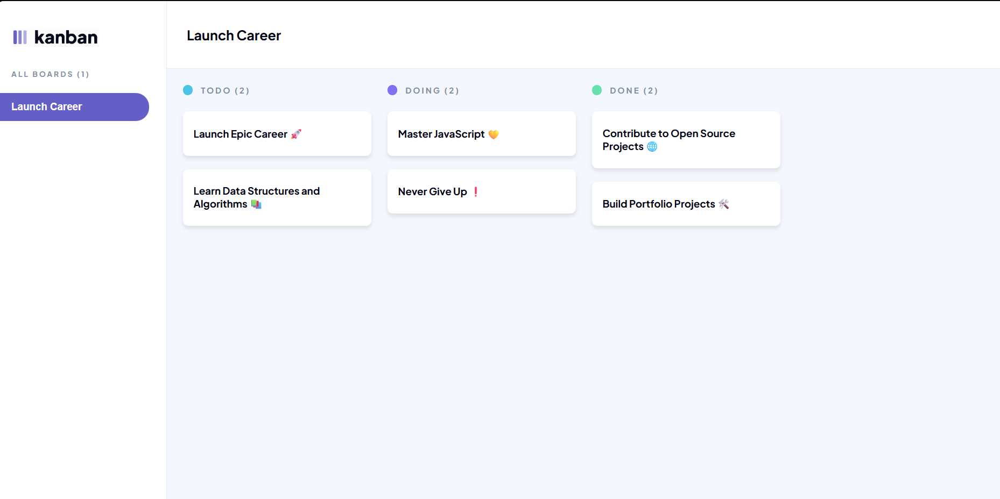
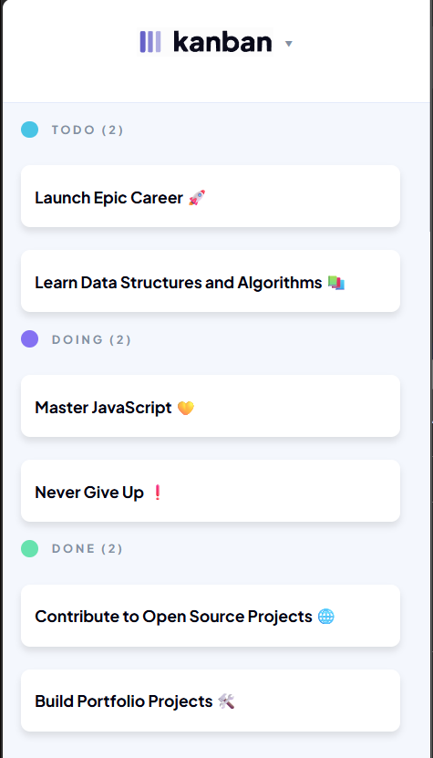

# 📋 Kanban Board Project
# Kanban Board by Brooklyn Treasurer
A clean and responsive **Kanban board** built with **HTML** and **CSS** to help visualize tasks in different workflow stages (To Do, Doing, Done).  
This project is designed to look like a professional Kanban tool and is **fully responsive for mobile devices**.

---

## 🚀 Features

- 🖥️ **Modern Desktop Layout** – Clean sidebar navigation and board columns  
- 📱 **Responsive Mobile Design** – Optimized for small screens using `@media` queries  
- 🎨 **Custom Styling** – Soft shadows, rounded cards, and a light color scheme  
- 🏷️ **Task Columns** – Separate sections for To Do, Doing, and Done  
- 🧩 **Reusable Components** – Easy-to-edit task cards and columns  
- 🖼️ **Custom Logo Integration** – Branded Kanban logo in the header

---

## 🖼️ Preview

| Desktop View                         | Mobile View                          |
|-------------------------------------|-------------------------------------|
|  |  |

---

## 🛠️ Tech Stack

- **HTML5** – Semantic markup for structure  
- **CSS3** – Custom styles and responsiveness  
- **Flexbox** – For layout alignment and spacing  
- **Media Queries** – To make it mobile-friendly

---


## ⚙️ Install & Run Instructions

Follow these simple steps to get the project running on your machine:

1. **Clone this repository**
   ```bash
   git clone https://github.com/BrooklynTreasurer/BROTRE25500_pto2505_GroupA_Brooklyn-Treasurer_JSL01-2025.git


